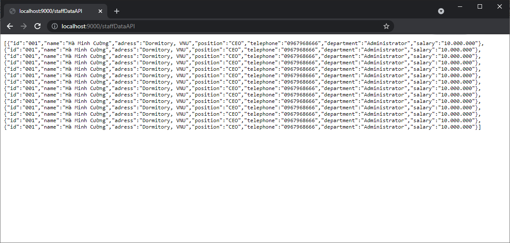

# Back-end Server

`npm start` to start this server.

**Front-end Server** can get the data from this server by access to API through URL:

- Staffs' data: http://localhost:9000/staffDataAPI
- Products' data: http://localhost:9000/productDataAPI

**Example:**

